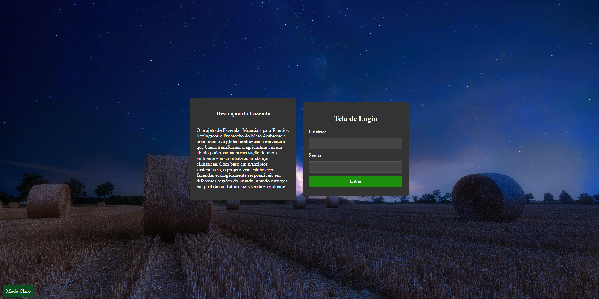

# Fazenda de todos (Login)

## Visão Geral do Projeto:
### O projeto de Fazendas Mundiais para Plantios Ecológicos e Promoção do Meio Ambiente é uma iniciativa global ambiciosa e inovadora que busca transformar a agricultura em um aliado poderoso na preservação do meio ambiente e no combate às mudanças climáticas. Com base em princípios sustentáveis, o projeto visa estabelecer fazendas ecologicamente responsáveis em diferentes regiões do mundo, unindo esforços em prol de um futuro mais verde e resiliente.

## Objetivos:

### Preservação da Biodiversidade: As fazendas envolvidas no projeto são comprometidas com a preservação da biodiversidade local, promovendo o equilíbrio dos ecossistemas e a conservação de espécies ameaçadas. A agricultura sustentável é desenvolvida em harmonia com a natureza, protegendo habitats e ecossistemas frágeis.

### Práticas Agrícolas Sustentáveis: O projeto prioriza o uso de práticas agrícolas sustentáveis, como agricultura orgânica, rotação de culturas, agroflorestas e uso eficiente de recursos naturais. Essas abordagens contribuem para a saúde do solo, redução da erosão e uso responsável da água.

### Promoção do Desenvolvimento Local: Além de contribuir para a saúde do planeta, as fazendas sustentáveis promovem o desenvolvimento socioeconômico das comunidades locais. O projeto visa empoderar agricultores e comunidades rurais, gerando renda e melhorando a qualidade de vida.

### edução das Emissões de Gases de Efeito Estufa: As fazendas adotam medidas para minimizar as emissões de gases de efeito estufa, como metano e dióxido de carbono, através do uso consciente de fertilizantes, manejo de resíduos e práticas de sequestro de carbono.

# Juntos por um Futuro Sustentável 🪴

